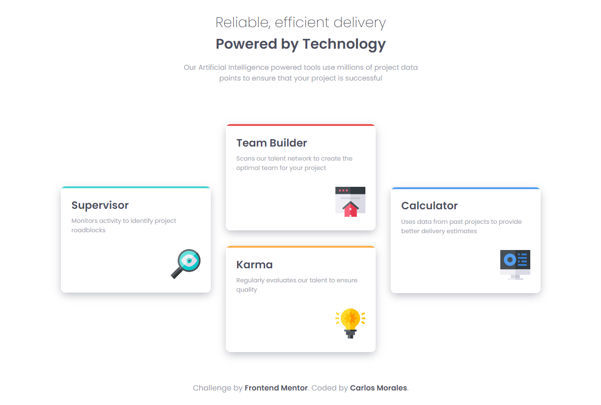
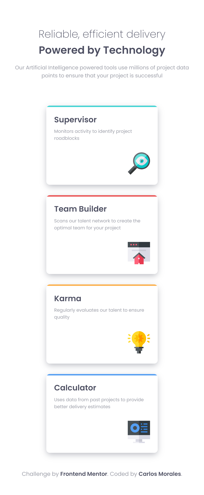

# Card Feature Section

## ✍🏻 Descripción

Realize este challenge de [Frontend Mentor](https://www.frontendmentor.io/) para poner a prueba mis skills de HTML, CSS y JS.

## 🚀 Comenzando

Solo debes clonarlo, abrir el index.html y listo 😊

## 🎨 Demo

Puedes ver el demo aquí → [Card Feature Section](https://cjosue15.github.io/card-feature-section/)

🖥 Version Escritorio

📱 Version Celular

## 🛠️ Construido con

-   HTML
-   CSS
-   JS

---

⌨️ con ❤️ por [Carlos Morales](https://github.com/cjosue15) 😊
